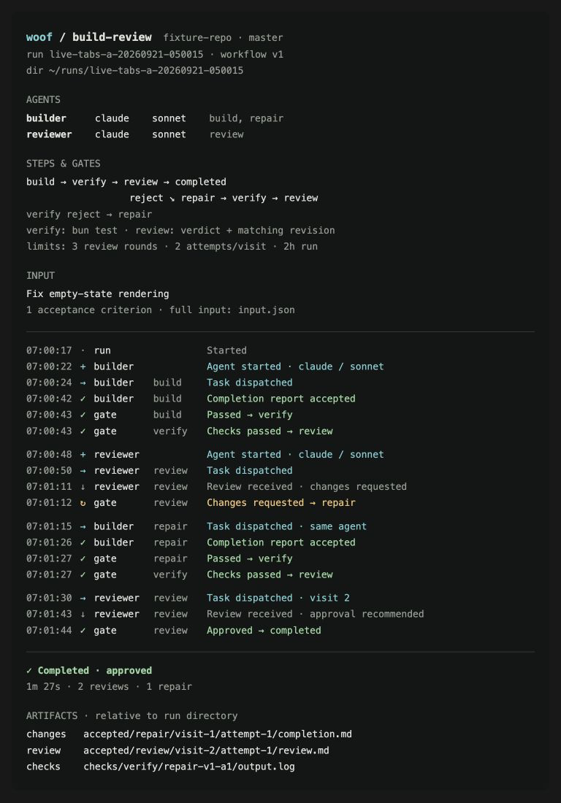

# Human-readable run output

Status: implemented (see [Observability](../architecture/observability.md),
"Implemented now (p4)": `woof watch` and the run host's own pane print this
view; the technical log lives in `<run-dir>/host.log`).

This brief defines the terminal experience for following a Woof run. It was
the implementation handoff for the builder; module structure, APIs and
rendering libraries were left to the implementation. Shipped behavior is
documented in [Observability](../architecture/observability.md).

## Purpose

Give developers one readable account of a run: who started, who is doing what,
what Woof is waiting for, what a gate decided and where the result is saved.

The current plain scheduler output often explains the work more clearly than
the colored event stream. Keep that direct language and combine it with the
colored stream's alignment and readability. Technical event names and runtime
identifiers should not dominate the developer experience.

The target is ordinary terminal output with scrollback, selection, copying and
redirection. A full-screen TUI, keyboard navigation and a dashboard are outside
this change. Coordinate with work already consolidating the two terminal views
so the result is one consistent human-facing presentation.

## Visual reference



The mockup is the approved visual direction, not evidence of implemented
behavior. Its timeline follows the example build-review run discussed during
design. The task, verification command, limits and shortened run-directory path
are illustrative. Render the actual run's values rather than copying the sample.
The terminal surface and spacing are a guide, not a pixel-perfect requirement.

## Information hierarchy

### Opening context

Print a compact opening block containing:

- Workflow name and version, repository/checkout context, run ID and run directory.
- An agent roster with each agent's name, provider/CLI kind, configured model and
  assigned stages. Show role separately when it differs from the agent's name.
- A small workflow map or step list that includes checks, gates and repair routes.
- The verification command, when configured, and the most relevant resolved limits.
- A readable preview of the input, with access to its full saved form.

The roster describes the planned participants. It does not imply that every
agent has already started. Keep a visible message when each agent actually
starts or attaches. Prefer meaningful agent and tab names over pane IDs; internal
IDs remain available in diagnostics. Unknown model or checkout information must
be described honestly, for example `provider default`.

For build-review, both failed verification and rejected review can lead to
repair. Omit verification when it is not configured. Other workflows should get
an appropriate map or step list rather than being forced into this example.

### Input preview

Default to a concise task title and acceptance-criteria count. Also support a
formatted JSON presentation with indentation and restrained syntax coloring.
Keep large descriptions, instructions and context from overwhelming the run
history: label excerpts, indicate omitted content and show the full input's path.
A preview must never look like the complete input when fields were omitted.

The choice between summary and JSON is a presentation preference. This brief
does not prescribe a CLI flag or configuration schema.

### Run history

Use a stable row structure:

```text
time      mark  agent/gate/run  stage   message
07:01:12  ↻     gate            review  Changes requested → repair
07:01:15  →     builder         repair  Task dispatched · same agent
```

Keep the timestamp and stage subdued, the participant name readable, and the
message prominent. Use local `HH:MM:SS` by default. Elapsed time from run start is
an optional alternative. Separate meaningful phases with modest whitespace.

Rows should describe work and decisions in plain English. They need not expose
one line for every internal event. Use `gate` for a gate decision and `run` for
run-wide information so an engine decision is not mistaken for an agent's claim.

Avoid repeating `visit 1 / attempt 1`. Show `visit 2` when a stage is revisited
and `attempt 2` when work is retried within a visit. Keep those concepts distinct.
When repair reuses the builder, explicitly preserve that identity in the output.

## Message vocabulary

These examples establish the tone and meaning. Equivalent wording is acceptable
when it communicates the actual state more accurately.

| Situation                               | Example message                                |
| --------------------------------------- | ---------------------------------------------- |
| Agent startup                           | `Agent started · claude / sonnet`              |
| Existing agent attached                 | `Agent attached · claude / sonnet`             |
| Waiting for readiness                   | `Waiting for agent to become ready`            |
| Work delivered                          | `Task dispatched`                              |
| Repair sent to the same builder         | `Task dispatched · same agent`                 |
| Waiting for a submission                | `Waiting for result`                           |
| Builder report validated and accepted   | `Completion report accepted`                   |
| Review received with a failing verdict  | `Review received · changes requested`          |
| Review received with a passing verdict  | `Review received · approval recommended`       |
| Review gate rejects                     | `Changes requested → repair`                   |
| Review gate passes                      | `Approved → completed`                         |
| Verification passes                     | `Checks passed → review`                       |
| Verification fails and routes to repair | `Checks failed → repair`                       |
| Repository revision check               | `Checking repository revision`                 |
| Revision changed after review           | `Revision changed → review again`              |
| Invalid result envelope                 | `Result rejected: missing completion artifact` |
| Repairing the result format             | `Fixing result format · attempt 2`             |
| Retrying substantive work               | `Retrying work · attempt 2`                    |
| Uncertain delivery                      | `Delivery unconfirmed · checking`              |
| Action required                         | `Blocked: permission required`                 |
| Host lost before a recorded outcome     | `Host lost · outcome unknown`                  |

Accepted review content is not the gate decision. A review recommending approval
must not make the run appear complete before the engine accepts the relevant
revision and records completion. Likewise, an accepted builder report does not
mean verification has passed.

Distinguish code repair, work retry and result-format repair. Do not translate
all three into a generic retry message. Delivery uncertainty must remain visible
and must not look like confirmed dispatch.

### Waiting and attention

Report meaningful changes in waiting state rather than every poll. Long waits
should remain understandable through occasional restrained updates or an
optional single-line elapsed-time indicator. The basic experience must work as
append-only output. Do not invent percentage progress or an ETA.

Waiting for a result does not prove that an agent is currently working. Display
only activity the engine can actually establish. Starting agents, revision
checks and running verification should be visible when they take noticeable time.

For a blocked run, show the reason and the concrete required action on a following
line. Name the relevant agent or known tab. Permission approval is one example;
use the actual required action rather than assuming every block has that cause.

### Color and symbols

| Treatment                        | Meaning                                                      |
| -------------------------------- | ------------------------------------------------------------ |
| Cyan with `+` or `→`             | Agent startup or work dispatched                             |
| Green with `✓`                   | Accepted completion report, passed gate or completed run     |
| Amber with `↻` or a warning mark | Changes requested, retry or recoverable problem              |
| Red with `!`                     | Failure, exhausted limit or required intervention            |
| Neutral/subdued with `·` or `↓`  | Context, waiting or received review awaiting a gate decision |

Color the marker and meaningful message rather than saturating the whole row.
Retain readable contrast on common light and dark terminal themes. A requested
cancellation can be neutral; it is not necessarily an error.

Words and symbols must carry the same meaning without color. Respect `NO_COLOR`,
produce clean redirected output and offer readable alternatives where Unicode
is unsuitable. Long names and messages must wrap without overlapping columns or
losing the participant's identity.

## Completion and diagnostics

End with a compact outcome summary: status and reason, duration, useful review
and repair counts, and paths to the accepted completion, review and verification
artifacts when available. Relative paths require a clearly printed run directory.
Keep paths copyable even when clickable terminal links are supported.

A failed, exhausted, cancelled or blocked run must remain visibly distinct from
successful completion. Show the relevant stage, reason and supported next action.
Do not suggest unsupported resume or recovery operations. Stopping the observer
or reaching its timeout is not the same as terminating the run.

Do not append a large result JSON object or print full envelopes in the default
human presentation. Keep machine-readable output and detailed diagnostics
available for agents and debugging. That includes event types, sequence numbers,
receipts, cursors, pane IDs, runtime IDs, hashes and full envelopes. Existing
machine-facing contracts must remain usable.

Envelope validation failures still need a useful explanation in the human view,
including the relevant missing or invalid field. Repeated display-metadata
warnings should be summarized without obscuring the run's actual outcome.
Failures that affect coordination or require action must remain prominent.

## Behavioral boundaries

The display consumes engine-owned facts and activity. It must not reconstruct
workflow state from terminal prose or invent waits from gaps between events.
The host's presentation and a separate observer must agree about the same run.
When attaching to an existing run, distinguish current context from replayed
history and avoid duplicate narrative rows.

Some desired activity messages are not currently available in the event stream.
The builder should decide how to expose them consistently through the existing
observation architecture. This brief intentionally does not prescribe new event
schemas, polling intervals, modules or APIs.

A first implementation can deliver the roster, history and summary from existing
facts. Full acceptance also includes truthful waiting and activity reporting;
missing activity should remain an explicit follow-up rather than guessed output.

## Acceptance

- A developer can identify participants and models, the current stage, why the
  run is waiting, a gate's decision, and the final result without reading raw events.
- The build → verify → review → repair → verify → review example is clear, including
  reuse of the same builder and a second review visit.
- Review receipt, gate approval and recorded run completion remain distinct.
- A failed check, format repair, work retry, ambiguous delivery, blocked agent,
  exhausted limit, cancellation and host loss each have truthful, useful output.
- Input is readable in summary and JSON form, with clear truncation and a path to
  the full saved input. The same applies to long names and artifact paths.
- Output remains usable at roughly 80 columns, with long messages, without color,
  and when redirected. It preserves terminal scrollback and copyable text.
- Starting observation partway through a run or stopping observation does not
  imply a false lifecycle transition or repeat already displayed history.
- The final summary points to the correct accepted artifacts, not a passing review
  of an earlier revision. Technical logs and machine-readable results remain available.
- Verify the implemented experience with representative automated checks and a
  real run. Inspect the terminal presentation and artifact contents, not just the
  presence of printed lines.

Related contracts: [domain model](../architecture/domain-model.md),
[communication and artifacts](../architecture/communication.md), and
[observability](../architecture/observability.md).
