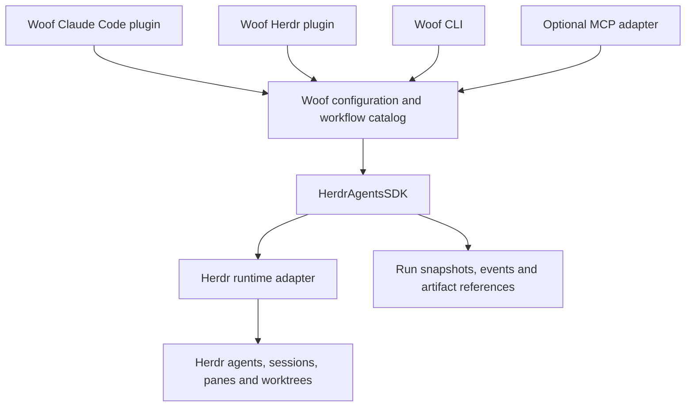

# Woof v1 architecture plan

Status: revised design baseline, 2026-09-14. Product requirements come from the
[brief](../product/brief.md); implementation recommendations below remain subject
to focused validation. This replaces the conflicting recommendations in the
earlier stashed draft without applying or modifying that stash.

## Ownership and dependency direction

Woof resolves intent into a run: workflow, input, roles, and project context.
The SDK validates and executes that resolved plan. Herdr performs the runtime
operations. Plugins consume the engine; the engine does not import plugin UI
code or require a Claude Code conversation to exist.

| Component                  | Owns                                                                         | Boundary                                                           |
| -------------------------- | ---------------------------------------------------------------------------- | ------------------------------------------------------------------ |
| Woof configuration/catalog | Role resolution, workflow discovery, project context and provenance          | Supplies resolved values to the SDK.                               |
| SDK runtime layer          | Agent handles, assignment ownership, requests and runtime capability mapping | Delegates actual execution and lifecycle detection to Herdr.       |
| SDK orchestration layer    | Scheduling, transitions, gates, limits, validation and run outcomes          | Works with runtime and storage interfaces rather than UI behavior. |
| SDK observation layer      | Current state, lifecycle events, accepted artifact references                | Gives every consumer the same meaning for a run.                   |
| Herdr integration          | Host actions, metadata and access to running agents                          | Presents engine state using host capabilities.                     |
| Claude Code integration    | Delegation, structured invocation, progress and result retrieval             | Uses the same engine as other callers.                             |

Keep runtime operations useful independently of workflows. Starting a reviewer
and assigning one task should not require authoring a multi-stage graph.

## Recommended first implementation

Retain the repository's TypeScript tooling. Start with clear module boundaries
inside the existing package; extract packages if the public SDK boundary needs
separate packaging. `HerdrAgentsSDK` is the requested library/API identity.
Names such as `@woof/sdk` and a workspace split are proposals, not publication
commitments.

Use explicit workflow definitions that declare agents, stages, input/output
contracts, transitions, and limits. TypeScript definitions are a reasonable
starting point given the existing project and older loader. The exact authoring
API should follow the first two complete workflows.

A sequential scheduler is enough for the first build/review and plan/build/review
flows. Keep events, accepted results, and transitions serialized under one owner
per run. Parallel research can extend the scheduling contract later without
putting research-specific branches in the engine.

A per-run process in a Herdr-managed pane is a useful hosting candidate: the run
has a visible owner and can outlive the caller. Validate its lifetime behavior
before choosing it. The SDK itself must remain directly consumable without that
plugin hosting arrangement. A shared daemon is not required by the product.

## Execution rules

1. Validate the input, workflow graph, resolved roles, and finite limits before
   launching workers. Capture the resolved configuration for this run.
2. Establish lifecycle observation before dispatch. Allocate a unique stage
   visit and attempt identity before a result can arrive.
3. Send a structured work request through Herdr's supported agent operations.
   Assign only one active request to an agent in the initial scheduler.
4. Collect the artifact and envelope through the defined result channel. Validate
   ownership, completeness, and the declared output contract.
5. Record the accepted result before acknowledging completion or publishing the
   transition. Duplicate delivery must not execute the transition twice.
6. Evaluate the gate using validated control data. Pass the exact accepted
   artifact reference into the next stage, including repair.
7. Record every transition, block, retry, rejected submission, and exhausted
   limit. Expose a structured terminal outcome on every exit path.

Ambiguous prompt delivery needs reconciliation rather than automatic resend.
Herdr's documented wait semantics do not provide per-request completion receipts;
the result contract supplies correlation. See
[communication](../architecture/communication.md).

## Persistence and liveness

Accepted artifacts and run history must remain inspectable after completion.
A journal plus derived snapshot is a reasonable small starting design; a database
is also possible. Commit/publication ordering and a single run owner matter more
than the file format. Persistence must not be advertised as automatic crash
resume without an explicit recovery contract and tests.

If the process responsible for a run disappears, observers need an explicit
lost-runtime condition rather than an indefinitely active run. `orphaned` is a
proposed diagnostic classification. Whether v1 can resume such a run, or only
inspect and terminate it, remains open. Herdr restoring an agent session does not
by itself restore Woof's scheduling decisions.

## Implementation sequence

| Slice                      | Reviewable outcome                                                                                                                                     |
| -------------------------- | ------------------------------------------------------------------------------------------------------------------------------------------------------ |
| Reconcile scaffold         | Review the existing scaffold branch against the brief; retain useful manifests and launchers without making MCP compulsory.                            |
| Prove result handoff       | One Herdr worker produces an artifact and submits a correlated envelope through a non-MCP path; malformed and duplicate submissions behave explicitly. |
| Define SDK contracts       | Domain types, runtime boundary, validation, state and observation work against a scripted runtime.                                                     |
| Execute a loop             | Build/review/repair preserves agent identity, artifacts, gate decisions, and finite limits.                                                            |
| Add product integration    | Layer configuration, expose Claude Code invocation and Herdr status, and retain structured results end to end.                                         |
| Prove reuse and acceptance | Add the second workflow and run the acceptance scenarios with real processes and agents.                                                               |

The detailed [decision record](../decisions/architecture.md) should be resolved
into a spec and then bounded implementation tickets. This documentation task
does not merge the scaffold, implement the engine, or report live acceptance.
